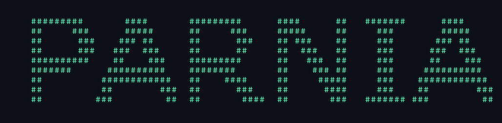
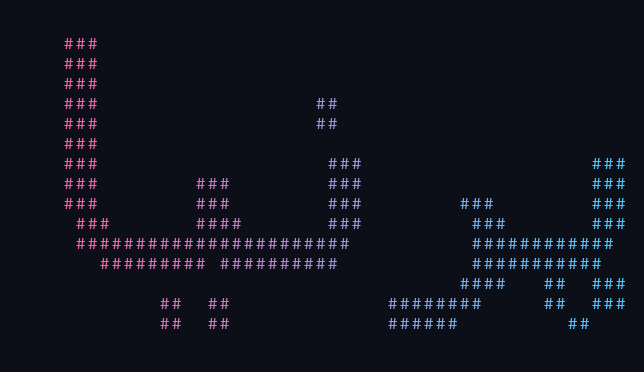

# Parnia

**A terminal art playground for names, messages and pictures.**

Draw your words with characters, animate them, add color, and save art to share.
English bitmap art runs with just Python. Optional extras enable Persian
lettering, rounded fonts, image conversion and PNG/GIF exports.


## Get started

Requires **Python 3.10+** on Windows, macOS or Linux.

```sh
git clone https://github.com/saeedghofrani/parnia.git
cd parnia
python -m venv .venv
```

Activate with `.venv\Scripts\Activate.ps1` in Windows PowerShell, or
`source .venv/bin/activate` on macOS/Linux. Then:

```sh
python -m pip install -r requirements.txt
python parnia.py
```

Choose a drawing character (Enter defaults to `#`), then type `Parnia` at
`Text >`. Keep entering names or messages. Type `/quit` or press Ctrl+C to exit.
If activation is unavailable on Windows, use `.venv\Scripts\python.exe`
in place of `python`. On systems that name Python `python3`, use that command.

For basic English text, skip the environment and installation and just
run `python parnia.py`.

## Try the playground

```sh
python parnia.py Parnia --color rainbow --animate typewriter
python parnia.py Parnia --theme binary --color gradient --animate pixels
python parnia.py Parnia --theme stars --animate fall --delay 0.08
python parnia.py --theme hearts --color neon --animate pixels
python parnia.py Parnia --message hello --font bold
```

| Feature | Options |
| --- | --- |
| Character theme | `classic` (`#`), `dots` (`.`), `binary` (`01`), `hearts` (`♥`), `stars` (`*`) |
| Font style | `block`, `tiny`, `bold`, `rounded`, `outline`, `shadow` |
| Color | `none`, `rainbow`, `gradient`, `neon` |
| Animation | `none`, `typewriter`, `pixels`, `fall` |
| Scale | `--scale 1` through `--scale 5` |
| Frame delay | `--delay 0` through `--delay 1`, in seconds |

`--char` overrides a theme; `--message` overrides both and cycles its characters
through the filled pixels. Fill messages must have 1–100 visible single-width
characters, without spaces. Examples: `hello` or `ILOVEYOU`.

```sh
python parnia.py Parnia --char .
python parnia.py Parnia --char 1
python parnia.py Parnia --char _
python parnia.py Parnia --char=-
python parnia.py Parnia --font tiny
python parnia.py Parnia --font shadow
python parnia.py Parnia --font outline --scale 3
python parnia.py Parnia --font rounded --color neon
```

Outline removes interior pixels; scale 3 or larger makes its hollow strokes
visible. Rounded uses a smooth system TrueType font instead of the block grid.
Choose a particular font with `--font-file path/to/font.ttf`.



## Persian names

```sh
python parnia.py "پرنیا" --color gradient
python parnia.py "سلام دنیا" --theme dots --export persian.png
```

Persian is detected automatically. The app shapes joined letters, applies
right-to-left ordering, then draws the result as a character bitmap.
It uses a font with Persian glyphs: Tahoma on Windows, DejaVu Sans on many
Linux systems, or Arial on macOS. If detection fails, pass
`--font-file /path/to/a/persian-font.ttf`.
Mixed Persian/English text works too. Persian uses the shaped font for all
styles except `tiny`, which is English-only. Fonts are read from your
computer and are not redistributed in this repository.



## Turn pictures into ASCII

```sh
python parnia.py --image photo.jpg --width 80
python parnia.py --image photo.png --width 100 --invert
python parnia.py --image photo.jpg --ramp "@#*. " --export photo.txt
python parnia.py --image examples/shapes.png --width 60
```

Brightness maps to a character ramp ordered **dark to light**. Conversion
accounts for terminal cell proportions, orientation and transparency.
Transparent pixels use a white background. Output width is 10–200 characters
and height is capped at 100 rows; inputs are limited to 20 megapixels.
Image conversion uses `--ramp` instead of text font/theme/fill options.

Sample input: [shapes.png](examples/shapes.png).
Sample output: [shapes.txt](examples/shapes.txt).

## Save and share

```sh
python parnia.py Parnia --export art.txt
python parnia.py Parnia --color rainbow --export art.png
python parnia.py Parnia --theme binary --color gradient --animate pixels --export art.gif
python parnia.py Parnia --color neon --font rounded --export neon.png
```

- **TXT:** UTF-8 text without ANSI color codes; no extras required.
- **PNG:** character art on a dark background with your selected palette.
- **GIF:** looping animation with a pause on completed art. Without an explicit
  animation, GIF export uses `typewriter`.

Neon image exports include a glow. Terminal neon uses bright green coloring.
GIFs use up to 24 frames, reduced for larger art. Image exports are capped at
4 million pixels per frame; use shorter text or a smaller scale if necessary.

The output folder must exist. Existing files are preserved unless you add
`--overwrite`. Exports also print the art to your terminal.

## Terminal behavior

Use a monospaced font and a Unicode/true-color terminal, such as Windows
Terminal. Some fonts display hearts as wider characters; try stars if needed.
Animations run when art fits the terminal. Oversized art and redirected output
get a single final frame. Redirected output contains no terminal control codes.

```sh
echo Parnia | python parnia.py --theme binary
python parnia.py Parnia --color rainbow > art.txt
python parnia.py --help
```

English bitmap fonts support A–Z, 0–9, spaces and `. , ! ? - _ : / + '`.
Lowercase is drawn as uppercase. Text is limited to 200 characters;
multiple lines work through piped input or the Python API.

## Python API

```python
from parnia import render
from parnia_art import render_text, animation_frames
from parnia_media import export_art, image_to_ascii

print(render("Parnia", character="."))  # Original API still works.
art = render_text("Parnia", theme="binary", style="bold", message="hello")
frames = animation_frames(art, effect="fall")
export_art(art, "parnia.gif", palette="gradient", animation="fall")
print(image_to_ascii("photo.jpg", width=80))
```

## Development

```sh
python -m unittest discover -s tests -v
python -m compileall -q parnia.py parnia_art.py parnia_cli.py parnia_media.py tests
```

Tests cover the original renderer, themes, fill messages, fonts, animation
completion, terminal output, interactive recovery, CLI validation, Persian
shaping, image conversion and TXT/PNG/GIF exports. Graphics tests skip when
extras are missing.

| File | Purpose |
| --- | --- |
| `parnia.py` | Original bitmap font, renderer and entry point |
| `parnia_art.py` | Styles, fill themes, palettes and animation frames |
| `parnia_media.py` | Shaped text, image conversion and exports |
| `parnia_cli.py` | CLI and interactive/terminal behavior |

Optional dependencies: [Pillow](https://pillow.readthedocs.io/),
[Arabic Reshaper](https://github.com/mpcabd/python-arabic-reshaper), and
[Python BiDi](https://python-bidi.readthedocs.io/).

Created by [Saeed Ghofrani](https://github.com/saeedghofrani).
